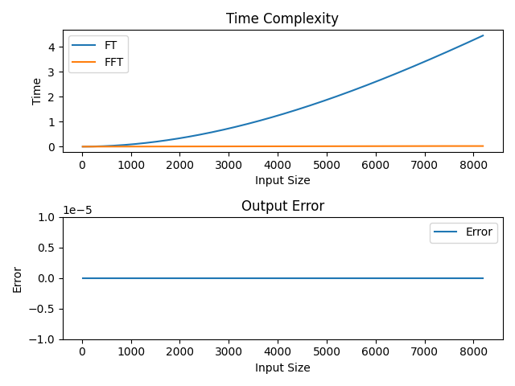

# Implementing FT & FFT in C++ 
C is the ultimate language when we look for speed and optimization. C++ code is compiled into binaries that can be called in Python.
To validate the implementation, i developed a simple program in python that can call FT functions several times with different signal lengths. For each call, python is used to calculate the time the function will take to return the results. 
Then, Compare the return arrays from both FT and FFT and show the error between them.
From the output plot, we can see that FT is in the order of N2 while FFT is in the order of NlogN.

### Installing Dependencies

#### Python 3.7

Follow instructions to install the latest version of python for your platform in the [python docs](https://docs.python.org/3/using/unix.html#getting-and-installing-the-latest-version-of-python)

#### Virtual Enviornment

It is recommended working within a virtual environment whenever using Python for projects. This keeps your dependencies for each project separate and organaized. Instructions for setting up a virual enviornment for your platform can be found in the [python docs](https://packaging.python.org/guides/installing-using-pip-and-virtual-environments/)

#### PIP Dependencies

Once you have your virtual environment setup and running, install dependencies by running:

```bash
pip install -r requirements.txt
```

This will install all of the required packages selected within the `requirements.txt` file.

## Implementing the project

First, clone the pybind11 repository by running:

```bash
git clone https://github.com/pybind/pybind11.git
```

Compile c++ code by running:
```bash
mkdir build
cd build/
cmake ..
make
```

Navigate back to the project directory by running: 
```bash
cd ../ 
```

### Runnig the program
```bash 
python run.py 
```

## Expected Ouput

