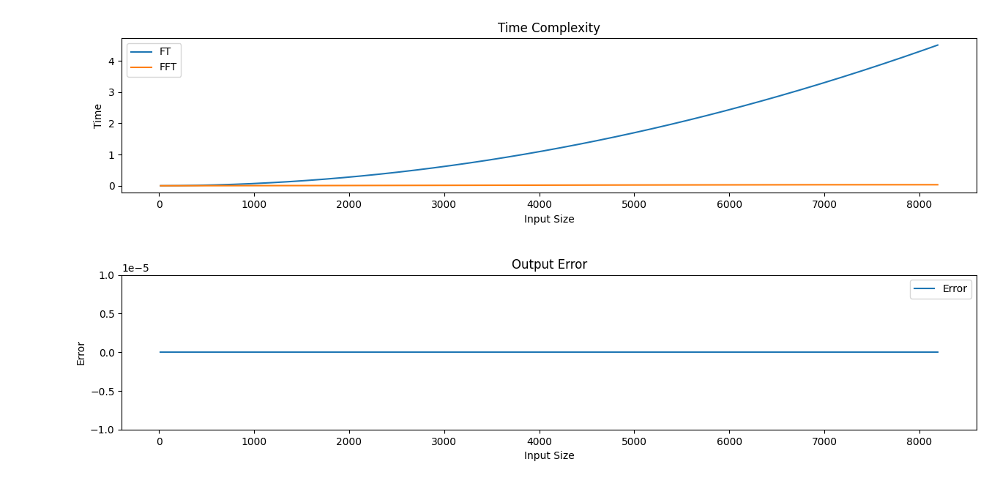

## Implementing FT & FFT in C++ for speed and optimization then compile it into binaries that can be called in python to compare their time complexity and show the error between them.

### Installing Dependencies

#### Python 3.7

Follow instructions to install the latest version of python for your platform in the [python docs](https://docs.python.org/3/using/unix.html#getting-and-installing-the-latest-version-of-python)

#### Virtual Enviornment

It is recommended working within a virtual environment whenever using Python for projects. This keeps your dependencies for each project separate and organaized. Instructions for setting up a virual enviornment for your platform can be found in the [python docs](https://packaging.python.org/guides/installing-using-pip-and-virtual-environments/)

#### PIP Dependencies

Once you have your virtual environment setup and running, install dependencies by running:

```bash
pip install -r requirements.txt
```

This will install all of the required packages selected within the `requirements.txt` file.

## Implementing the project

First, clone the pybind11 repository by running:

```bash
git clone https://github.com/pybind/pybind11.git
```

Compile c++ code by running:
```bash
mkdir build
cd build/
cmake ..
make
```

Navigate back to the project directory by running: 
```bash
cd ../ 
```

### Runnig the program
```bash 
python3 run.py 
```

## Expected Ouput
